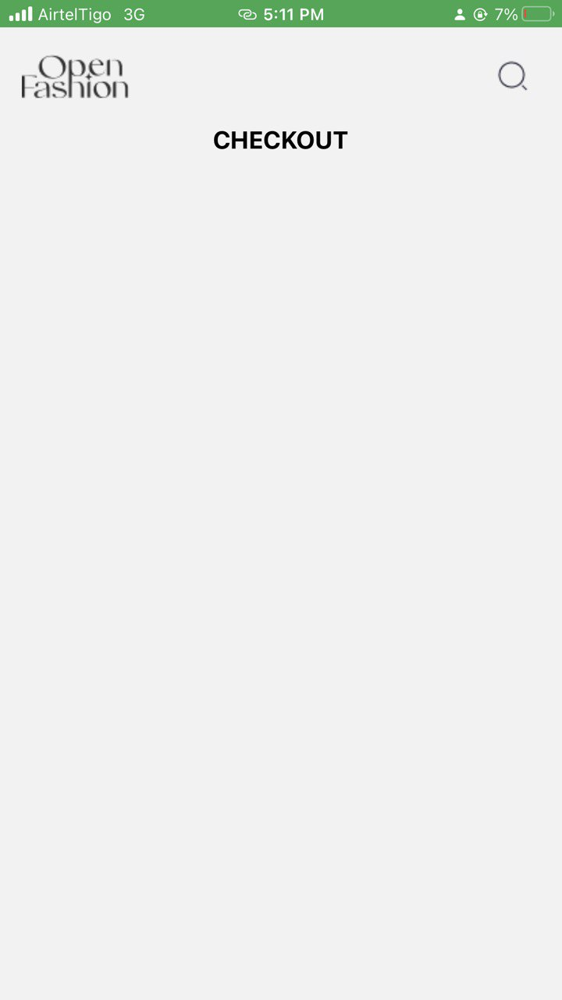
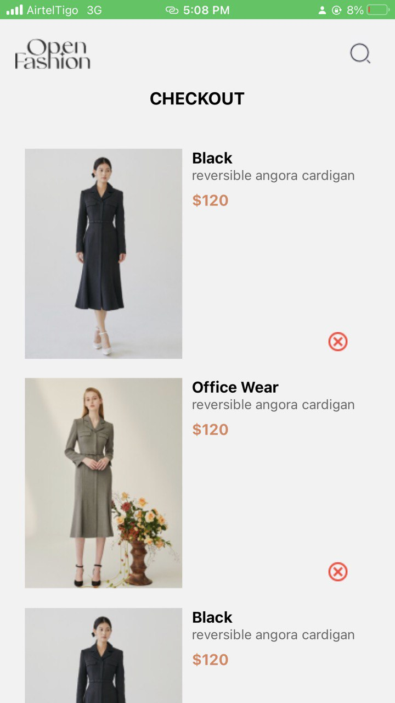
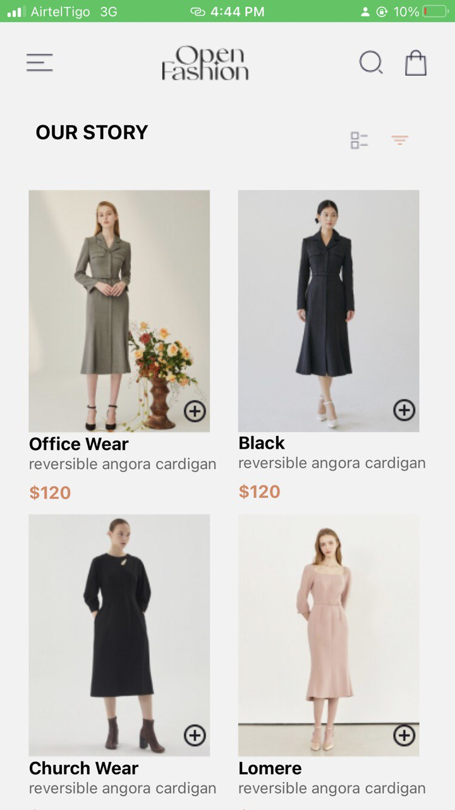

# React Native Shopping Application

## Overview

This project is a mobile shopping application designed to provide users with a seamless experience when browsing and purchasing dresses. The app features a user-friendly interface that simplifies the shopping process, allowing users to view different dress options, add them to a shopping bag, and proceed to checkout.

## Features

- Browse through a variety of dresses.
- Add dresses to a shopping bag.
- Proceed to checkout to complete purchases.

## Technologies Used

- **React Native**: A popular framework for building native mobile applications using JavaScript and React.
- **Expo**: Simplifies the development and deployment of React Native applications.
- **React Navigation**: Provides a way to navigate between screens in a React Native application.

## Getting Started

To get started with this project, ensure you have Node.js installed on your system. Then, follow these steps:

1. Clone the repository to your local machine.
2. Navigate to the project directory.
3. Install the necessary dependencies by running `npm install`.
4. Start the development server by running `npm start`.

## Running the Application

To run the application on an Android device or emulator, execute `npm run android`. For iOS, use `npm run ios`.

## Contributing

Contributions to improve the application are welcome. Please feel free to submit a pull request.

## License

This project is licensed under the MIT License. See the LICENSE file for more details.

## Screenshots

