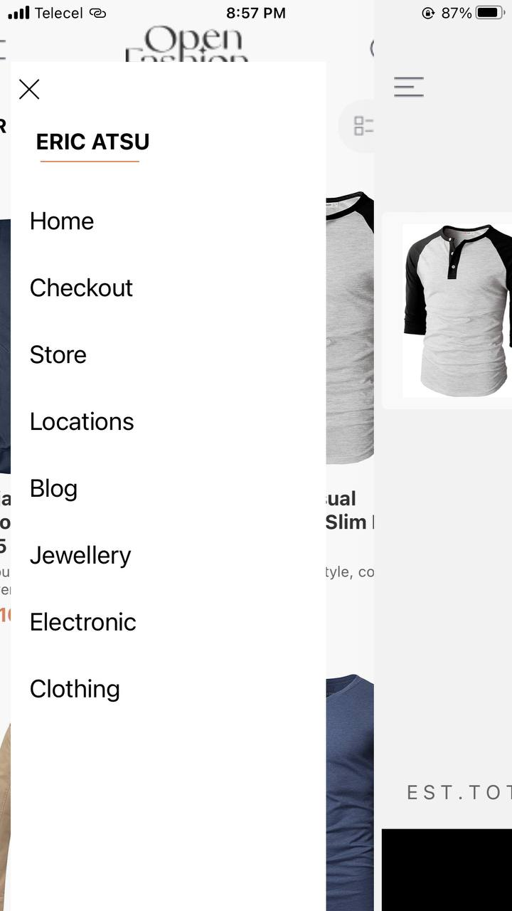
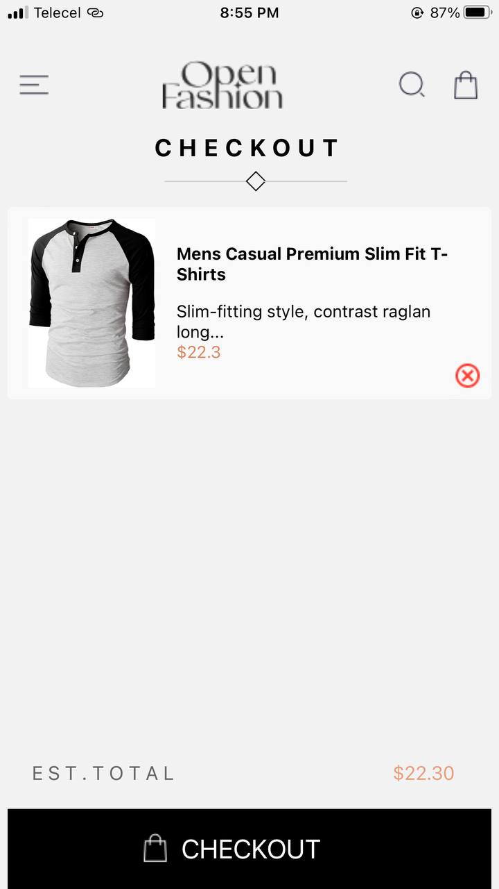
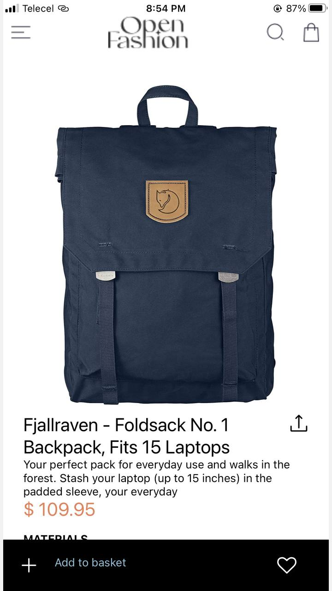
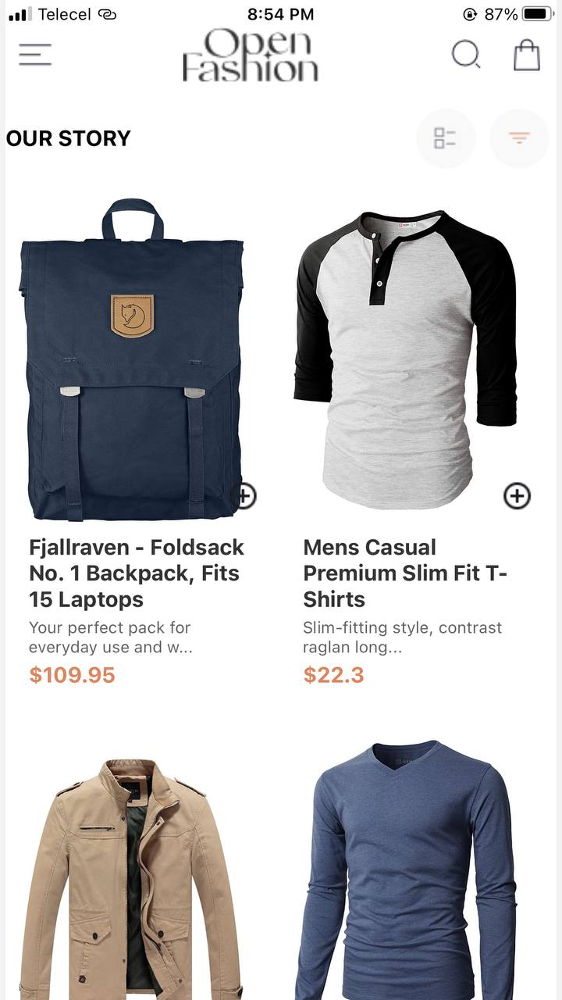

This workspace contains a React Native mobile application for shopping dresses. Let's break down the details:

### What does this project do?

- This project is a mobile shopping application that allows users to browse through a variety of dresses, add them to a shopping bag, and proceed to checkout to complete purchases.

### Why does this project exist?

- The project exists to provide users with a seamless shopping experience for dresses. It aims to simplify the shopping process by offering a user-friendly interface for browsing and purchasing dresses.

### Main Technologies Used:

- **React Native**: A framework for building native mobile applications using JavaScript and React.
- **Expo**: Simplifies the development and deployment of React Native applications.
- **React Navigation**: Facilitates navigation between screens in a React Native application.

### Codebase Organization:

- **App.js**: The main entry point of the application.
- **components/**: Directory containing various screen components such as `blogScreen.js`, `checkoutScreen.js`, `clothingScreen.js`, etc.
- **assets/**: Contains images used in the application like dress images, icons, logos, etc.
- **babel.config.js**: Configuration file for Babel.
- **package.json**: Contains project metadata and dependencies.
- **package-lock.json**: Lock file for dependency versions.
- **README.md**: Provides an overview of the project, features, technologies used, setup instructions, and more.
- **photo_1_2024-07-03_21-10-16.jpg**, **photo_2_2024-07-03_21-10-16.jpg**, **photo_3_2024-07-03_21-10-16.jpg**: Images showcasing different screens of the application.

### Getting Started:

1. Clone the repository to your local machine.
2. Navigate to the project directory.
3. Install dependencies by running `npm install`.
4. Start the development server with `npm start`.

### Running the Application:

- To run the application on Android, use `npm run android`. For iOS, use `npm run ios`.

### Contributing:

- Contributions to improve the application are welcome via pull requests.

### License:

- The project is licensed under the MIT License.

### Screenshots:

 
 
 

In summary, this React Native shopping application aims to enhance the dress shopping experience for users by providing a visually appealing and user-friendly interface for browsing and purchasing dresses.

